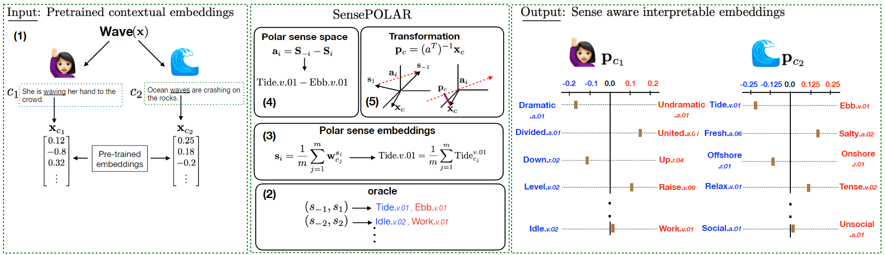

# SensePOLAR
> SensePOLAR: Word sense aware interpretability for pre-trained contextual word embeddings Jan Engler, Sandipan Sikdar, Marlene Lutz and Markus Strohmaier accepted at EMNLP'22 (findings)

The first (semi-) supervised framework for augmenting interpretability into contextual word embeddings (BERT).  
Interpretability is added by rating words on scales that encode user-selected senses, like correctness or left-right-direction.

***Please cite our paper in any published work that uses any of these resources.***
~~~
Coming soon
~~~

## Abstract
Adding interpretability to word embeddings represents an area of active research in text representation. Recent work has explored the potential of embedding words via so-called polar dimensions (e.g. good vs. bad, correct vs.wrong). Examples of such recent approaches include SemAxis, POLAR, FrameAxis, and BiImp. Although these approaches provide interpretable dimensions for words, they have not been designed to deal with polysemy, i.e. they can not easily distinguish between different senses of words. To address this limitation, we present SensePOLAR, an extension of the original POLAR framework that enables word-sense aware interpretability for pre-trained contextual word embeddings. The resulting interpretable word embeddings achieve a level of performance that is comparable to original contextual word embeddings across a variety of natural language processing tasks including the GLUE and SQuAD benchmarks. Our work removes a fundamental limitation of existing
approaches by offering users sense aware interpretations for contextual word embeddings.

SensePOLAR overview. Pre-trained contextual word embeddings are transformed into an interpretable
space where the word’s semantics are rated on scales individually encoded by opposite senses such as “good”↔“bad”.
The scores across the dimensions are representative of the strength of relationship (between word and dimension)
which allows us to rank the dimensions and thereby identify the most discriminative dimensions for a word. In this
example, the word “wave” is used in two senses: hand waving and ocean wave. SensePOLAR not only generates
dimensions that are representative of individual contextual meanings, the alignment to the respective sense spaces
also aligns well with human judgement. SensePOLAR generates neutral scores for dimensions not related to the
word in the given context (e.g., “idle”↔“work”, “social”↔“unsocial”). We follow the WordNet convention to
represent a particular sense of a word. For example, “Tide.v.01” represents the word “tide” in the sense of surge
(rise or move forward).

## Usage
This first commit only contains the most basic functionalities of the SensePOLAR framework.  
Any given word will be transformed into our interpretable Word Embedding space and the individual ratings on the scales can be analyzed.  
The scales, where the word is rated the highest (we call these the 'top SensePOLAR dimensions'), are shown.  
These dimensions are usually the most descriptive dimensions for a word.  

After installing the python packages below:  
Simply run 'python polarC.py' in the main folder and follow the instructions.

## GLUE
You can also evaluate the SensePOLAR Embeddings on the GLUE Benchmark.  
See the corresponding README in the downstream_tasks/GLUE directory.

## Prerequisites
### Python packages
* scipy 1.7.1
* transformers 4.12.3
* pickleshare 0.7.5
* torch 1.9.0
* torchaudio 0.9.0
* torchmetrics 0.5.1
* torchvision 0.10.0
* numpy 1.21.1
* datasets 2.28.1
* sklearn 1.1.2

* (python 3.8.10)

## Literatur
Static POLAR framework:  
Mathew, B., Sikdar, S., Lemmerich, F., & Strohmaier, M. (2020, April). The polar framework: Polar opposites enable interpretability of pre-trained word embeddings. In Proceedings of the Web Conference 2020 (pp. 1548-1558).
BERT Model:  
Devlin, J., Chang, M. W., Lee, K., & Toutanova, K. (2018). Bert: Pre-training of deep bidirectional transformers for language understanding. arXiv preprint arXiv:1810.04805.
